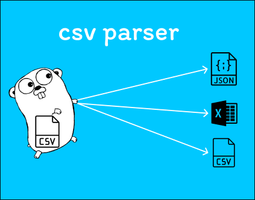

# CSV Parser CLI



Утилита командной строки для анализа, фильтрации и экспорта CSV-файлов.  
Поддерживает валидацию, сортировку, поиск, агрегации, сравнение файлов и логирование.

---

## Установка:

```bash
git clone https://github.com/Freyzan2006/csv-parser.git
cd csv-parser
go build -o csv-parser ./cmd
```

## Все функции:
| Флаг             | Описание                                                          |
| ---------------- | ----------------------------------------------------------------- |
| `-file`          | Путь к CSV-файлу (**обязательный**)                               |
| `-required`      | Обязательные поля (через запятую), пример: `Name,Age`             |
| `-validate-type` | Проверка типов, пример: `Age:int,Price:float`                     |
| `-range`         | Диапазоны значений, пример: `Age:18-65`                           |
| `-filter`        | Фильтрация строк, пример: `Age>30`                                |
| `-sort`          | Сортировка, пример: `Age:desc` или `Name:asc`                     |
| `-header`        | Учитывать ли заголовки (по умолчанию `true`)                      |
| `-out-format`    | Формат вывода: `csv`, `json`, `excel` (по умолчанию `csv`)        |
| `-aggregate`     | Агрегации: `Age:sum`, `Price:avg`                                 |
| `-search`        | Поиск строк по значению, пример: `Name=John`                      |
| `-page`          | Номер страницы (для пагинации, начиная с `1`)                     |
| `-per-page`      | Количество записей на странице (по умолчанию `10`)                |
| `-compare`       | Сравнить с другим CSV-файлом                                      |
| `-encoding`      | Кодировка файла (`utf-8`, `windows-1251`, `cp1251`, `iso-8859-1`) |
| `-log`           | Писать логи в файл, пример: `-log=output.log`                     |
| `-verbose`       | Подробный вывод в консоль                                         |


# Примеры:

## Основные функции:

**Файл с данными**
```bash
./csv-parser -file=input.csv
```

**Заголовки**
```bash
./csv-parser -file=input.csv -header=false
```

**Кодировка**
```bash
./csv-parser -file=input.csv -encoding=windows-1251
```
*utf-8, windows-1251, cp1251, iso-8859-1*

## Валидация:

**Обязательные поля**
```bash
./csv-parser -file=input.csv -required="Name,Age"
```

**Проверка типов**
```bash
./csv-parser -file=input.csv -validate-type="Age:int,Name:string"
```
*int, float, string*

**Диапазоны значений**
```bash
./csv-parser -file=input.csv -range="Age:18-65"
```

## Фильтрация и поиск:

**Фильтрация**
```bash
./csv-parser -file=input.csv -filter="Age>25"
```
**Поиск**
```bash
./csv-parser -file=input.csv -search="Name=John"
```

## Сортировка:

**Сортировка**
```bash
./csv-parser -file=input.csv -sort="Price:desc"
```

## Агрегации:

**Агрегация**
```bash
./csv-parser -file=input.csv -aggregate="Age:sum,Age:max"
```
*sum, avg, min, max, count*

## Форматы вывода:

**Экспорт** 
```bash
./csv-parser -file=input.csv -out-format=json
./csv-parser -file=input.csv -out-format=excel
```
Все виды: *csv, json, excel*

## Постраничный вывод:
```bash
./csv-parser -file=input.csv -page=2
```

```bash
./csv-parser -file=input.csv -per-page=5
```

## Сравнение файлов:

**Сравнение файлов**
```bash
./csv-parser -file=input.csv -compare=output.csv
```

## Подробный вывод:
```bash
./csv-parser -file=input.csv -verbose
```

## Логирование:
```bash
./csv-parser -file=input.csv -log=output.log
```

# Примеры комплексного использования:
```bash
# Найти всех пользователей старше 30 лет, отсортировать по возрасту по убыванию и вывести в JSON
./csv-parser -file=users.csv -filter="Age>30" -sort=Age:desc -out-format=json

# Посчитать средний возраст и сохранить результат в Excel
./csv-parser -file=users.csv -aggregate=Age:avg -out-format=excel

# Сравнить два файла и записать результат в логи
./csv-parser -file=new.csv -compare=old.csv -log=diff.log

```


---